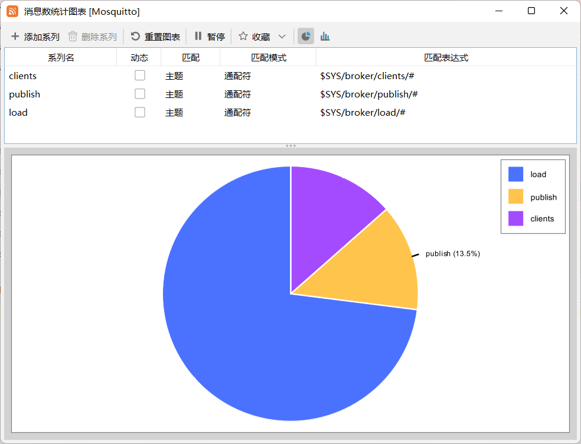
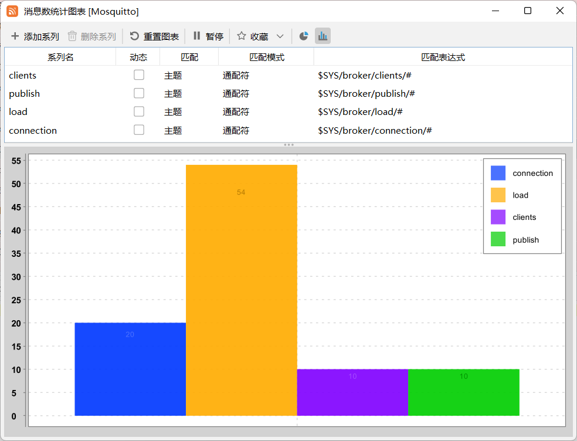
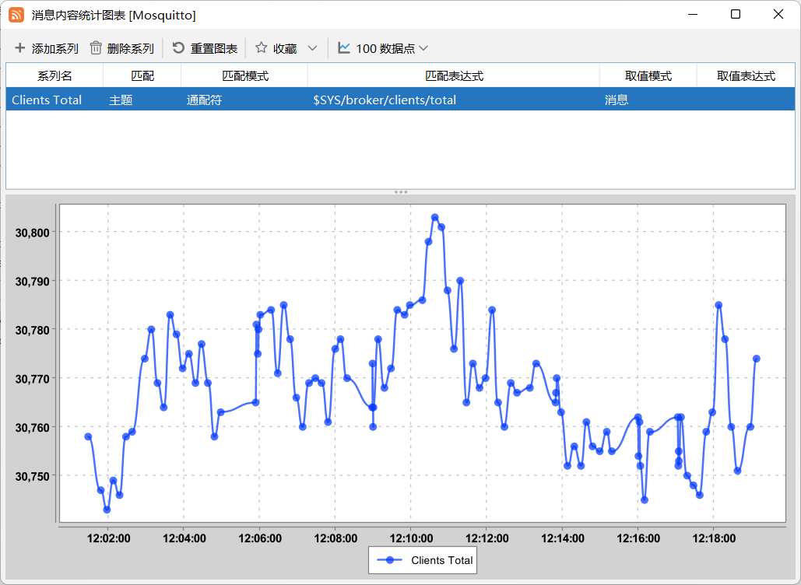

 MqttInsight - MQTT Client GUI
--

MqttInsight is an open source cross platform MQTT desktop client.

## Features:

* Support MQTT3 and MQTT5;
* Support Websocket;
* Provide two message views: table and dialogue;
* Support Node.js JavaScript (Supported by Javet);
* Supports regular message encoding and decoding such as PlainText, JSON, XML, HEX, and Base64, as well as SPI extended
  codecs;
* Provide charts such as message quantity, message load, and message content statistics;

## Screenshots

## Documents

* [Scripting](Scripting.md)
* [Changelog](Changelog.md)
