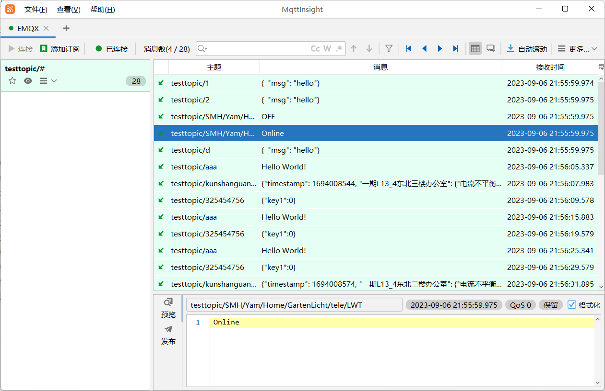
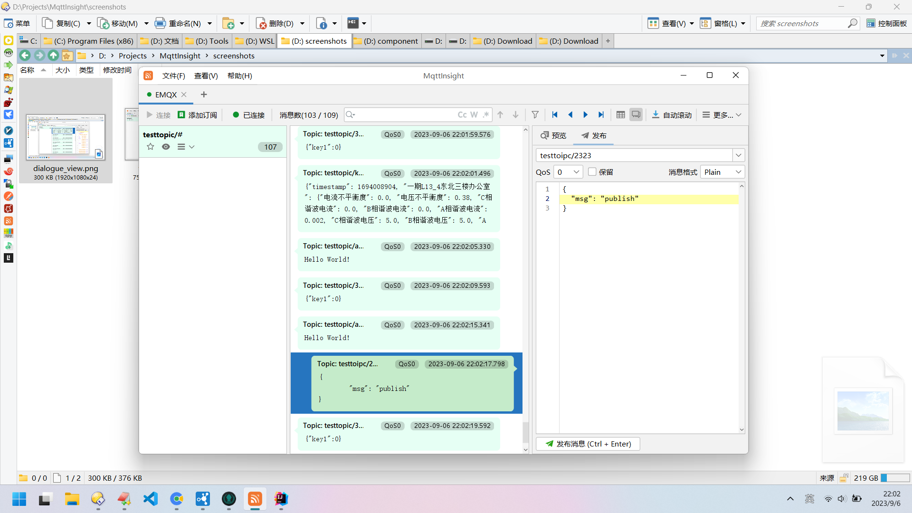

 MqttInsight
--

MqttInsight 是一个使用 java swing 开发的 MQTT 图形客户端.

## 主要功能

* 支持 MQTT3、MQTT5；
* 支持表格和对话两种消息视图；
* 支持 Node.js 脚本 (Javet)；
* 支持 PlainText、JSON、XML、HEX 和 Base64 常规消息编解码, 支持 SPI 扩展编解码器；

## 界面截图

## 文档

* [脚本说明](Scripting.md)
* [版本记录](Changelog.md)
